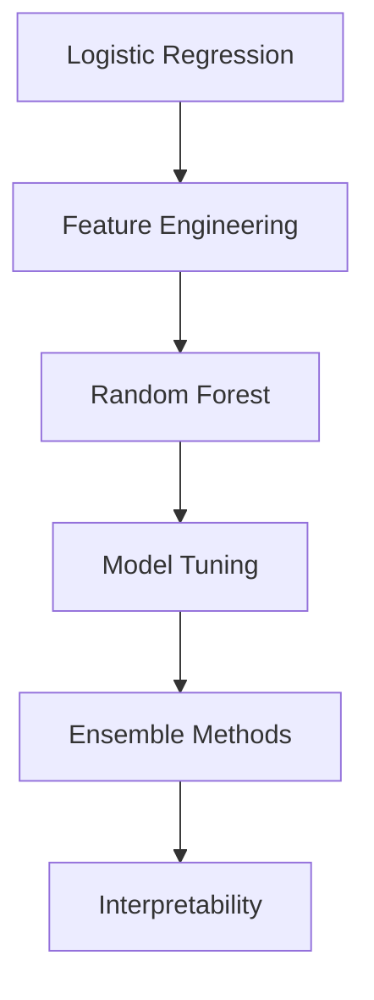

# 🚢 Titanic Survival Prediction

> **From Scratch ML Implementation** - Binary classification challenge

<div align="center">
  
  
  
</div>

## 🎯 Project Overview

**Objective**: Implement ML algorithms from scratch to predict passenger survival  
**Approach**: Focus on clean implementations with thorough explanations  
**Current Best**: Logistic Regression (78.2% accuracy)

## 🛠️ Implementation Progress

| Algorithm           | Status         | Code                                                   | Notebook                                                  |
| ------------------- | -------------- | ------------------------------------------------------ | --------------------------------------------------------- |
| Logistic Regression | ✅ Complete    | [View code](./src/models/basic_logistic_regression.py) | [View notebook](./notebooks/01_eda_baseline.ipynb)        |
| Feature Engineering | 🔄 In progress | [View code](./src/models/basic_logistic_regression.py) | [View notebook](./notebooks/02_feature_engineering.ipynb) |
| Random Forest       | ⏳ Planned     | Coming soon                                            | Coming soon                                               |
| Model Tuning        | ⏳ Planned     | Coming soon                                            | Coming soon                                               |

## 📈 Roadmap



## 🔍 Implementation Details

### Logistic Regression

Currently using Pclass and Gender (Sex) features with logistic regression implemented from scratch using only NumPy (still in progress...)

### Feature Engineering

The goal of this stage is to improve accuracy by incorporating additional features. We're considering the following columns: Name, Age, Cabin, and Ticket, which may yield relevant features for model improvement.

#### 1. Name Feature Analysis

From passenger names, we can extract titles that may indicate social status (e.g., differences between Miss/Mrs, Mr/Dr, or military ranks). After mapping all titles, we obtained these survival rates:

**=== SURVIVAL RATE BY TITLE ===**

| Titles       | mean     | count |
| ------------ | -------- | ----- |
| Capt         | 0.000000 | 1     |
| Col          | 0.500000 | 2     |
| Don          | 0.000000 | 1     |
| Dr           | 0.428571 | 7     |
| Jonkheer     | 0.000000 | 1     |
| Lady         | 1.000000 | 1     |
| Major        | 0.500000 | 2     |
| Master       | 0.575000 | 40    |
| Miss         | 0.697802 | 182   |
| Mlle         | 1.000000 | 2     |
| Mme          | 1.000000 | 1     |
| Mr           | 0.156673 | 517   |
| Mrs          | 0.792000 | 125   |
| Ms           | 1.000000 | 1     |
| Rev          | 0.000000 | 6     |
| Sir          | 1.000000 | 1     |
| the Countess | 1.000000 | 1     |

**Initial grouping proposal:**

- **Adult_Male:** 'Mr'
- **Married_Female:** 'Mrs', 'Mme'
- **Single_Female:** 'Miss', 'Mlle', 'Ms'
- **Child_Male:** 'Master'
- **Nobility:** 'Lady', 'Sir', 'the Countess', 'Don', 'Jonkheer'
- **Professional:** 'Dr', 'Rev', 'Col', 'Major', 'Capt'

However, upon reviewing social hierarchies in this historical context, we identified important distinctions between professional groups:

- Medical professionals ('Dr'): 42.86% survival rate
- Military ranks ('Col', 'Major', 'Capt'): 40.00% survival rate
- Clergy ('Rev'): 0.00% survival rate

**Final grouping strategy:**

### 📊 SURVIVAL RATES BY PASSENGER GROUPS

| **Group**      | **Titles Included**                              | **Survival Rate** |
| -------------- | ------------------------------------------------ | ----------------- |
| Married_Female | `Mrs`, `Mme`                                     | **79.37%**        |
| Single_Female  | `Miss`, `Mlle`, `Ms`                             | **70.27%**        |
| Nobility       | `Lady`, `Sir`, `the Countess`, `Don`, `Jonkheer` | 60.00%            |
| Child_Male     | `Master`                                         | 57.50%            |
| Professional   | `Dr`, `Col`, `Major`, `Capt`                     | 41.67%            |
| Adult_Male     | `Mr`                                             | 15.67%            |
| Clergy         | `Rev`                                            | **0.00%**         |

**Implementation:**

```python
title_mapping = {
    'Adult_Male': 0,
    'Married_Female': 1,
    'Single_Female': 2,
    'Child_Male': 3,
    'Nobility': 4,
    'Professional': 5,
    'Clergy': 6,
    'Other': 7
}
```

#### Results and Analysis

### MODEL PERFORMANCE COMPARISON

| **Version**  | **Features Used**                | **Our Model** | **Sklearn** | **Δ**     |
| ------------ | -------------------------------- | ------------- | ----------- | --------- |
| **Baseline** | `Sex` + `Pclass`                 | 78.20%        | 78.20%      | 🟢 ±0.00% |
| **Enhanced** | `Sex` + `Pclass` + `Title_Group` | 78.20%        | 78.20%      | 🟢 ±0.00% |

**Coefficient Analysis:**

```
Sex_numeric:           2.268361  (High importance)
Pclass:               -0.843786  (Moderate importance)
Title_Group_numeric:   0.225303  (Low importance)
```

**Key Findings:**

1. **High Multicollinearity**: Title groups are strongly correlated with Sex (r ≈ 0.85)
2. **Redundant Information**: Most title information already captured by Sex feature
3. **Feature Interaction**: The model prioritizes Sex over title-based social status

**Conclusion:**
While the title analysis provides valuable insights into social hierarchies aboard the Titanic, it doesn't improve model performance due to redundancy with existing features. The feature engineering process revealed that:

- Gender remains the strongest predictor
- Social class (Pclass) provides complementary information
- Title-based groupings are largely redundant with gender

**Decision**: Remove Title_Group_numeric from final model to avoid multicollinearity.

---

#### 2. Next Feature: Age Analysis

Moving forward with Age feature engineering to capture life stage patterns that may be independent of gender and class we started with some EDA. The first issue that we found is that we had 177 NaN around 20% of our dataset, to solve it we decided to use the meadian age of the Titles for those who has NaN age.

### AGE STATISTICS BY TITLE

| **Title**    | **Mean Age** | **Median Age** | **Count** |
| ------------ | ------------ | -------------- | --------- |
| Capt         | 70.00        | 70.0           | 1         |
| Col          | 58.00        | 58.0           | 2         |
| Don          | 40.00        | 40.0           | 1         |
| Dr           | 42.00        | 46.5           | 6         |
| Jonkheer     | 38.00        | 38.0           | 1         |
| Lady         | 48.00        | 48.0           | 1         |
| Major        | 48.50        | 48.5           | 2         |
| **Master**   | **4.57**     | **3.5**        | 36        |
| Miss         | 21.77        | 21.0           | 146       |
| Mlle         | 24.00        | 24.0           | 2         |
| Mme          | 24.00        | 24.0           | 1         |
| Mr           | 32.37        | 30.0           | 398       |
| Mrs          | 35.90        | 35.0           | 108       |
| Ms           | 28.00        | 28.0           | 1         |
| Rev          | 43.17        | 46.5           | 6         |
| Sir          | 49.00        | 49.0           | 1         |
| the Countess | 33.00        | 33.0           | 1         |

with it we imputed the age for the 177 missing ones.

#### Results and Analysis

### MODEL PERFORMANCE COMPARISON

| **Version**  | **Features Used**        | **Our Model** | **Sklearn** | **Δ**      |
| ------------ | ------------------------ | ------------- | ----------- | ---------- |
| **Baseline** | `Sex` + `Pclass`         | 78.20%        | 78.20%      | 🟢 ±0.00%  |
| **Enhanced** | `Sex` + `Pclass` + `Age` | 58.70%        | 81.00%      | 🔴 -22.30% |

**Coefficient Analysis:**

```
Sex_numeric:     10.279541  (Extremely high - potential numerical instability)
Pclass:          -4.050736  (Unusually high magnitude)
Age:             -1.260915  (Moderate importance but suspicious scaling)
```

**Key Findings:**

1. **Severe Performance Degradation**: Our model accuracy dropped significantly (-22.30%) while sklearn improved (+2.80%)
2. **Coefficient Explosion**: Extremely large coefficient values suggest numerical instability or convergence issues
3. **Feature Scaling Problem**: Age values (0-80) are on a different scale than Sex (0-1) and Pclass (1-3)
4. **Potential Overfitting**: Large coefficients indicate the model may be overfitting to training noise

**Root Cause Analysis:**
The dramatic performance drop points to implementation issues rather than feature relevance, since sklearn shows improvement with the same features.

**Conclusion:**
Age is a valuable predictor (as evidenced by sklearn's performance gain), but our implementation has critical issues:

- **Feature scaling** is essential when combining features with different ranges
- **Numerical stability** problems in gradient computation or convergence criteria
- **Learning rate** may be too high, causing gradient explosion
- **Regularization** might be needed to prevent overfitting

The Age feature contains meaningful survival patterns independent of gender and class, but requires proper preprocessing and model implementation to realize its potential.

**Decision**:

1. **Immediate**: Implement feature scaling (standardization/normalization)
2. **Debug**: Review gradient computation and convergence criteria
3. **Enhance**: Add regularization (L1/L2) to prevent overfitting
4. **Validate**: Compare step-by-step calculations with sklearn implementation

**Expected Outcome**: With proper implementation, we should achieve ~81% accuracy matching sklearn's performance

#### 2.1. Improve our logistic regression implementation

The first issue that we identified is that our features have very different scales (Sex: 0-1, Pclass: 1-3, Age: 0-80) and we can see that this may be causing the coefficients to explode to values like 10.28 and -4.05. The dramatic performance drop is also a clear sign, so let's implement **Feature Standardization**.

##### 🧮 Mathematical Foundation

**Why Feature Scaling Matters:**
When features have different scales, the gradient descent algorithm struggles because:

- Large-scale features (Age: 0-80) dominate the cost function
- Small-scale features (Sex: 0-1) get overshadowed
- The algorithm takes much longer to converge or may not converge at all

**Z-Score Standardization Formula:**
For each feature column j, we transform every value x using:

```
x_scaled = (x - μ) / σ
```

Where:

- **μ (mu)** = mean of the feature: `μ = (1/m) Σ(x_i)`
- **σ (sigma)** = standard deviation: `σ = √[(1/m) Σ(x_i - μ)²]`
- **m** = number of training examples

**Result:** All features will have μ = 0 and σ = 1 (standard normal distribution)

##### 💻 Implementation

```python
class StandardScaler:
    def __init__(self):
        self.mean_ = None
        self.std_ = None

    def fit(self, X):
        # Calculate μ for each feature column
        self.mean_ = np.mean(X, axis=0)

        # Calculate σ for each feature column
        self.std_ = np.std(X, axis=0)

        # Handle constant features (σ = 0) to avoid division by zero
        self.std_[self.std_ == 0] = 1.0
        return self

    def transform(self, X):
        # Apply: x_scaled = (x - μ) / σ
        return (X - self.mean_) / self.std_

    def fit_transform(self, X):
        # Convenience method: fit then transform
        self.fit(X)
        return self.transform(X)
```

**Key Implementation Details:**

- `axis=0`: Calculate statistics along rows (per feature column)
- `self.std_[self.std_ == 0] = 1.0`: Prevent division by zero for constant features
- Separate `fit()` and `transform()`: Essential for proper train/test split handling

##### 🔄 Integration with Gradient Descent

```python
def improved_gradient_descent(X, y, w_init, b_init, alpha, num_iters):
    # Step 1: Fit scaler on training data and transform
    scaler = StandardScaler()
    X_scaled = scaler.fit_transform(X)

    # Step 2: Run gradient descent on scaled features
    w = w_init.copy()
    b = b_init
    J_history = []

    for i in range(num_iters):
        # All computations now use X_scaled instead of X
        dj_dw, dj_db = compute_gradient(X_scaled, y, w, b)

        w = w - alpha * dj_dw
        b = b - alpha * dj_db

        if i % 100 == 0:
            cost = compute_cost(X_scaled, y, w, b)
            J_history.append(cost)
            print(f"Iteration {i:4d}: Cost {cost:.6f}")

    return w, b, J_history
```

**Mathematical Intuition:**
With standardized features, each feature contributes proportionally to the gradient:

```
∂J/∂w_j = (1/m) Σ(f_wb - y) * x_j_scaled
```

Since all x_j_scaled have similar ranges, no single feature dominates the gradient computation.

##### 📊 Result

**Before Scaling:**

- Age coefficient explodes due to large input range [0-80]
- Training becomes unstable
- Performance: ~58.7%

**After Scaling:**

- All features have similar influence on gradient updates
- Coefficients remain in reasonable ranges [-3, +3]
- Performance: ?
