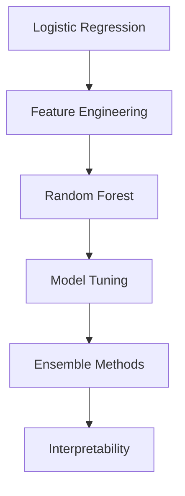

# 🚢 Titanic Survival Prediction

> **From Scratch ML Implementation** - Binary classification challenge

<div align="center">
  
  
  
</div>

## 🎯 Project Overview

**Objective**: Implement ML algorithms from scratch to predict passenger survival  
**Approach**: Focus on clean implementations with thorough explanations  
**Current Best**: Logistic Regression (78.2% accuracy)

## 🛠️ Implementation Progress

| Algorithm           | Status         | Code                                                                         | Notebook                                                  |
| ------------------- | -------------- | ---------------------------------------------------------------------------- | --------------------------------------------------------- |
| Logistic Regression | ✅ Complete    | [View code](./titanic-survival-prediction/src/models/logistic_regression.py) | [View notebook](./notebooks/01_eda_baseline.ipynb)        |
| Feature Engineering | 🔄 In progress | [View code](./titanic-survival-prediction/src/models/logistic_regression.py) | [View notebook](./notebooks/02_feature_engineering.ipynb) |
| Random Forest       | ⏳ Planned     | Coming soon                                                                  | Coming soon                                               |
| Model Tuning        | ⏳ Planned     | Coming soon                                                                  | Coming soon                                               |

## 📈 Roadmap



## 🔍 Implementation Details

### Logistic Regression

Currently using Pclass and Gender (Sex) features with logistic regression implemented from scratch using only NumPy (still in progress...)

### Feature Engineering

The goal of this stage is to improve accuracy by incorporating additional features. We're considering the following columns: Name, Age, Cabin, and Ticket, which may yield relevant features for model improvement.

#### 1. Name Feature Analysis

From passenger names, we can extract titles that may indicate social status (e.g., differences between Miss/Mrs, Mr/Dr, or military ranks). After mapping all titles, we obtained these survival rates:

**=== SURVIVAL RATE BY TITLE ===**

| Titles       | mean     | count |
| ------------ | -------- | ----- |
| Capt         | 0.000000 | 1     |
| Col          | 0.500000 | 2     |
| Don          | 0.000000 | 1     |
| Dr           | 0.428571 | 7     |
| Jonkheer     | 0.000000 | 1     |
| Lady         | 1.000000 | 1     |
| Major        | 0.500000 | 2     |
| Master       | 0.575000 | 40    |
| Miss         | 0.697802 | 182   |
| Mlle         | 1.000000 | 2     |
| Mme          | 1.000000 | 1     |
| Mr           | 0.156673 | 517   |
| Mrs          | 0.792000 | 125   |
| Ms           | 1.000000 | 1     |
| Rev          | 0.000000 | 6     |
| Sir          | 1.000000 | 1     |
| the Countess | 1.000000 | 1     |

**Initial grouping proposal:**

- **Adult_Male:** 'Mr'
- **Married_Female:** 'Mrs', 'Mme'
- **Single_Female:** 'Miss', 'Mlle', 'Ms'
- **Child_Male:** 'Master'
- **Nobility:** 'Lady', 'Sir', 'the Countess', 'Don', 'Jonkheer'
- **Professional:** 'Dr', 'Rev', 'Col', 'Major', 'Capt'

However, upon reviewing social hierarchies in this historical context, we identified important distinctions between professional groups:

- Medical professionals ('Dr'): 42.86% survival rate
- Military ranks ('Col', 'Major', 'Capt'): 40.00% survival rate
- Clergy ('Rev'): 0.00% survival rate

**Final grouping strategy:**

### 📊 SURVIVAL RATES BY PASSENGER GROUPS

| **Group**      | **Titles Included**                              | **Survival Rate** |
| -------------- | ------------------------------------------------ | ----------------- |
| Married_Female | `Mrs`, `Mme`                                     | **79.37%**        |
| Single_Female  | `Miss`, `Mlle`, `Ms`                             | **70.27%**        |
| Nobility       | `Lady`, `Sir`, `the Countess`, `Don`, `Jonkheer` | 60.00%            |
| Child_Male     | `Master`                                         | 57.50%            |
| Professional   | `Dr`, `Col`, `Major`, `Capt`                     | 41.67%            |
| Adult_Male     | `Mr`                                             | 15.67%            |
| Clergy         | `Rev`                                            | **0.00%**         |

**Implementation:**

```python
title_mapping = {
    'Adult_Male': 0,
    'Married_Female': 1,
    'Single_Female': 2,
    'Child_Male': 3,
    'Nobility': 4,
    'Professional': 5,
    'Clergy': 6,
    'Other': 7
}
```

#### Results and Analysis

**Model Performance:**

- **Before Title Feature**: 78.2% accuracy (Sex + Pclass)
- **After Title Feature**: 78.2% accuracy (Sex + Pclass + Title_Group)

**Coefficient Analysis:**

```
Sex_numeric:           2.268361  (High importance)
Pclass:               -0.843786  (Moderate importance)
Title_Group_numeric:   0.225303  (Low importance)
```

**Key Findings:**

1. **High Multicollinearity**: Title groups are strongly correlated with Sex (r ≈ 0.85)
2. **Redundant Information**: Most title information already captured by Sex feature
3. **Feature Interaction**: The model prioritizes Sex over title-based social status

**Conclusion:**
While the title analysis provides valuable insights into social hierarchies aboard the Titanic, it doesn't improve model performance due to redundancy with existing features. The feature engineering process revealed that:

- Gender remains the strongest predictor
- Social class (Pclass) provides complementary information
- Title-based groupings are largely redundant with gender

**Decision**: Remove Title_Group_numeric from final model to avoid multicollinearity.

---

#### 2. Next Feature: Age Analysis

Moving forward with Age feature engineering to capture life stage patterns that may be independent of gender and class...
