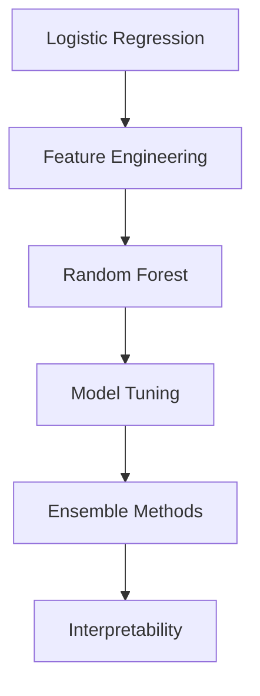

# 🚢 Titanic Survival Prediction

> **From Scratch ML Implementation** - Binary classification challenge

  
  
  

## 🎯 Project Overview

**Objective**: Implement ML algorithms from scratch to predict passenger survival  
**Approach**: Focus on clean implementations with thorough explanations  
**Current Best**: Logistic Regression (78.2% accuracy)

## 🛠️ Implementation Progress

| Algorithm           | Status         | Code                                                                         | Notebook                                                                       |
| ------------------- | -------------- | ---------------------------------------------------------------------------- | ------------------------------------------------------------------------------ |
| Logistic Regression | ✅ Complete    | [View code](./titanic-survival-prediction/src/models/logistic_regression.py) | [View notebook](./titanic-survival-prediction/notebooks/01_eda_baseline.ipynb) |
| Feature Engineering | 🔄 In progress | Coming soon                                                                  | Coming soon                                                                    |
| Random Forest       | ⏳ Planned     | Coming soon                                                                  | Coming soon                                                                    |
| Model Tuning        | ⏳ Planned     | Coming soon                                                                  | Coming soon                                                                    |

## 📈 Roadmap

## 🔍 Implementation Details

### Logistic Regression

Currently using Pclass and Gender (Sex) features with logistic regression implemented from scratch using only NumPy (still in progress...)

### Feature Engineering

The goal of this stage is to improve accuracy by incorporating additional features. We're considering the following columns: Name, Age, Cabin, and Ticket, which may yield relevant features for model improvement.

From passenger names, we can extract titles that may indicate social status (e.g., differences between Miss/Mrs, Mr/Dr, or military ranks). After mapping all titles, we obtained these survival rates:

=== SURVIVAL RATE BY TITLE ===

| Titles       | mean     | count |
| ------------ | -------- | ----- |
| Capt         | 0.000000 | 1     |
| Col          | 0.500000 | 2     |
| Don          | 0.000000 | 1     |
| Dr           | 0.428571 | 7     |
| Jonkheer     | 0.000000 | 1     |
| Lady         | 1.000000 | 1     |
| Major        | 0.500000 | 2     |
| Master       | 0.575000 | 40    |
| Miss         | 0.697802 | 182   |
| Mlle         | 1.000000 | 2     |
| Mme          | 1.000000 | 1     |
| Mr           | 0.156673 | 517   |
| Mrs          | 0.792000 | 125   |
| Ms           | 1.000000 | 1     |
| Rev          | 0.000000 | 6     |
| Sir          | 1.000000 | 1     |
| the Countess | 1.000000 | 1     |

Initial grouping proposal:

- **Adult_Male:** 'Mr'
- **Married_Female:** 'Mrs', 'Mme'
- **Single_Female:** 'Miss', 'Mlle', 'Ms'
- **Child_Male:** 'Master'
- **Nobility:** 'Lady', 'Sir', 'the Countess', 'Don', 'Jonkheer'
- **Professional:** 'Dr', 'Rev', 'Col', 'Major', 'Capt'

However, upon reviewing social hierarchies in this historical context, we notice important distinctions between:

- Medical professionals ('Dr')
- Military ranks ('Col', 'Major', 'Capt')
- Clergy ('Rev')

Survival rates analysis:

- Doctors: 42.86% (7 instances)
- Military: 40.00% (5 instances combined)
- Clergy: 0.00% (6 instances)

Combined group survival rates:

- Doctors + Military: 41.67%
- Clergy: 0.00%

Other groups will be reviewed next... (To be continued)
