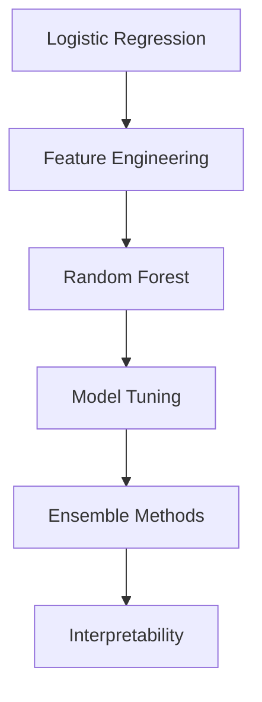

# 🚢 Titanic Survival Prediction

> **From Scratch ML Implementation** - Binary classification challenge

  
  
  

## 🎯 Project Overview

**Objective**: Implement ML algorithms from scratch to predict passenger survival  
**Approach**: Focus on clean implementations with thorough explanations  
**Current Best**: Logistic Regression (78.2% accuracy)

## 🛠️ Implementation Progress

| Algorithm           | Status         | Code                                                                         | Notebook                                                                       |
| ------------------- | -------------- | ---------------------------------------------------------------------------- | ------------------------------------------------------------------------------ |
| Logistic Regression | ✅ Complete    | [View code](./titanic-survival-prediction/src/models/logistic_regression.py) | [View notebook](./titanic-survival-prediction/notebooks/01_eda_baseline.ipynb) |
| Feature Engineering | 🔄 In progress | Coming soon                                                                  | Coming soon                                                                    |
| Random Forest       | ⏳ Planned     | Coming soon                                                                  | Coming soon                                                                    |
| Model Tuning        | ⏳ Planned     | Coming soon                                                                  | Coming soon                                                                    |

## 📈 Roadmap

